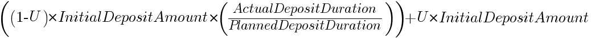
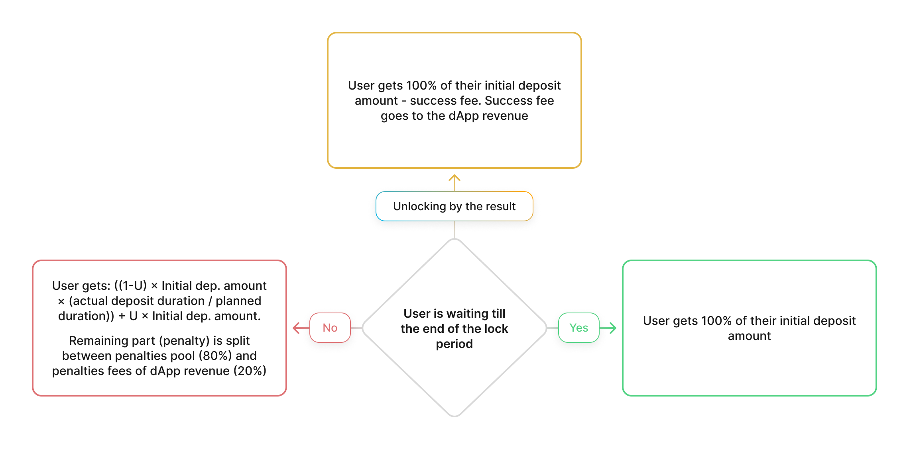

In the first type of vaults the user will pay a penalty in case of premature withdrawal. There are three scenarios:

**Scenario 1**: Unlocking after the end of the deposit period.

The user gets 100% of his initial deposit amount, incentive reward is liquid and can be used immediately after claiming (weekly basis)

**Scenario 2**: Unlocking before the maturity date.

The user gets the number of tokens according this formula:

Where U is the unlocking coefficient, which is different for every vault and depends on the duration of locking (This coefficient is shown in the vault’s parameters in Algem app).

Remaining part (penalty) is split between the penalties pool (80%) and dApp revenue (20%). Tokens from the penalties pool are distributed between remaining users.

Example: If the user wants to withdraw his initial deposit of 1000 ASTR from the Vault 1 (U = 0,9) on the 50th day, he will receive 950 ASTR + all accumulated incentive reward. 40 ASTR go to the penalties pool, 10 ASTR go to the dApp revenue.

**Scenario 3**: Algem wants to create a new investment tool for the long-term investors to help them reach a great result. So, if the user achieves the result and the locked asset grows in price by N times (As for an early stage project, N = 5 for ASTR) since it was locked, Algem will let this user unlock the asset without the penalty (In this case, there are no reasons to continue to lock tokens). The user will pay a success fee. This opportunity will have been opened as long as the price of the locked asset is above the target price.

