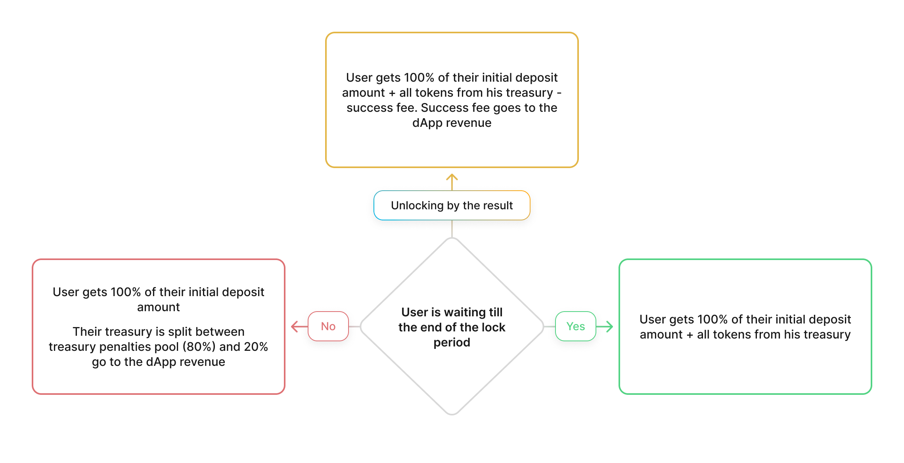

In the second type of vaults the user can withdraw 100% of his initial deposit before the maturity date, but he will lose practically all accumulated reward.

ASTR + ALGM incentive reward are distributed on a weekly basis, user can claim 20% of the ALGM reward for this period initially (To have an opportunity to take part in voting and staking), 80% of ALGM reward from every cycle and 100% of ASTR reward go to his treasury. So the user’s treasury becomes bigger cycle-by-cycle. He can receive all tokens from his treasury only after the end of the deposit period.

In case of the premature withdrawal their treasury is split between penalties pool (and distributed among the users is this Vault) and dApp revenue by 80% and 20% respectively. The user will receive 100% of his initial ASTR deposit.
