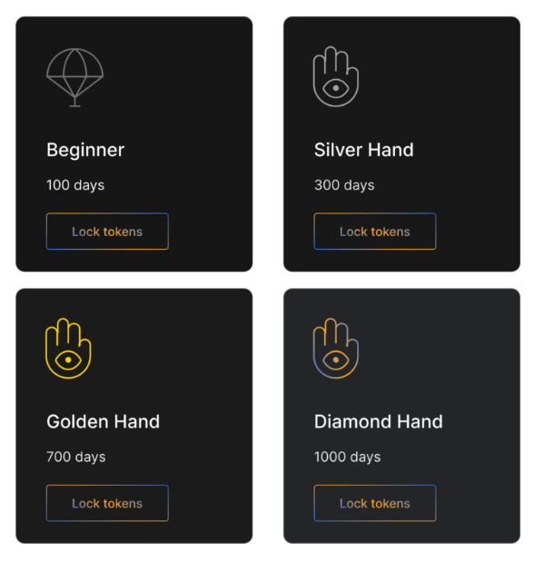

Algem offers to lock tokens (only ASTR will be available after the first iteration’s launch) in eight vaults to the user’s choice. Vaults vary in duration and reward weights: the more duration is, the more rewards this vault and users in it get.

When locking occurs, the user gets nASTR tokens (Liquid representation of the locked tokens. These tokens can be used in different DeFi Dapps and inside Algem) and starts to earn extra reward via Algem’s triple rewards system.

Later Algem will provide numerous investment tools, locking is a first of them.
