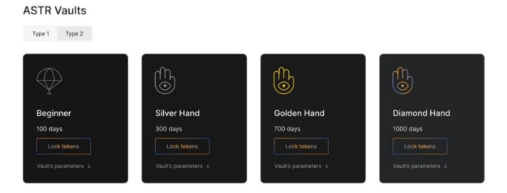

There are two types of vaults and a user can chose:

**Type 1**: user gets incentive rewards on a weekly basis. The incentive rewards are liquid and can be used immediately. In case of premature withdrawal the user will pay a penalty, charged from the initial deposit.
**Type 2**: user gets incentive rewards on a weekly basis, but this reward goes to his treasury. The user can claim all tokens from the treasury only after the end of a deposit period. In case of the premature withdrawal the user will receive 100% of the initial deposit, but he loses all tokens from the treasury.

Type 1 vaults get 60% of all incentive rewards, type 2 — 40%.

Initially, four vaults in each vault type will be represented:
- 100 days;
- 300 days;
- 700 days;
- 1000 days.

(These durations can be changed before the launch.)

Vaults vary in duration, reward weight, minimum deposit, and initial deposit fee.

The most important parameter except duration is reward weight. The more duration is, the more incentive rewards this vault gets.

Initial weights have been set as follows:
- 100 days — 7% of all incentive rewards;
- 300 days — 18%;
- 700 days — 35%;
- 1000 days — 40%.

The user gets rewards according to his share in the vault.

