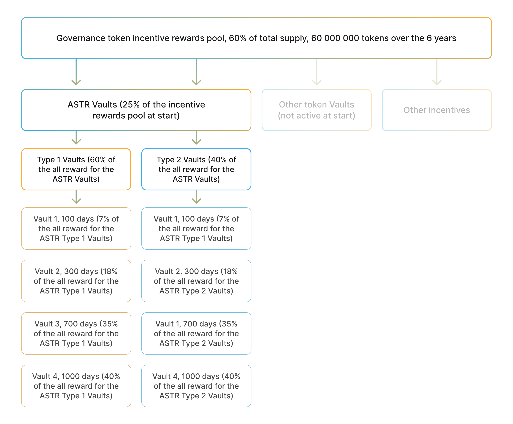

Algem’s team has allocated 60% (60 000 000 tokens) of the ALMG token supply for the Incentives. These tokens will be distributed to our users over the 6 years.

From the beginning only ASTR vaults are available. These vaults receive 25% of the incentive pool (15 000 000 ALGM). This number of tokens can be changed in the future via voting. 

The waterfall of the governance token (ALGM) incentives looks as follows:

