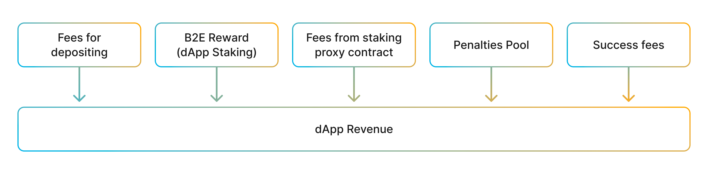

Staking of our governance token (ALGM) is a mechanism to distribute dApp revenue among the users. Users can stake their ALGM and receive a part of the dApp revenue according to their share in the staking pool.

Reward accumulates during the cycle (1week) and can be claimed after the end of each cycle . If a user unstake his tokens before the end of the cycle, he will receive all of the accumulated reward. 

Algem distributes 80% of the dApp revenue via ALGM staking. 

**Q: Which token will I receive via ALGM staking?**

The biggest part of the dApp revenue (Fees + B2E reward) is represented by ASTR tokens. Small part, which comes from the penalties pool of the second type vaults, in ALGM tokens. 
So, your staking reward will consist of  approximately 99% ASTR tokens and 1% (or even less) ALGM tokens. 
